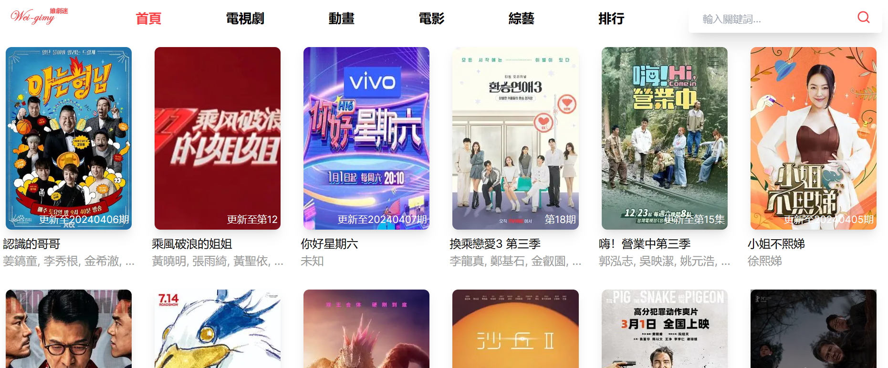
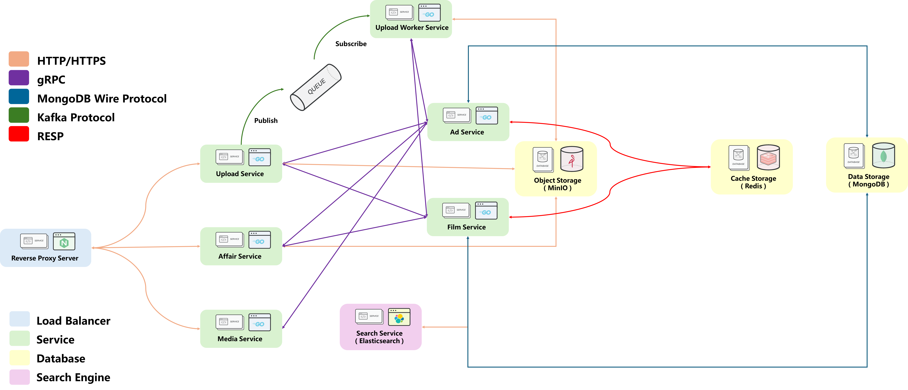

## Who am I ? 🤔
Hello 👋👋 My name is 童俊維 ( Tcweeei ).

I'm a software engineer in Taiwan. I'm interested in lots of subject including devops, front-end, back-end, AI etc.

## How can I do ? 😁

| Front-end | WebSite | App | Language                | FrameWork    | 
|-----------|---------|-----|-------------------------|--------------|
|           | ✔️      | ❌   | JavaScript / TypeScript | React.js     |
|           | ✔️      | ❌   | JavaScript / TypeScript | Next.js      |
|           | ❌       | ✔️  | JavaScript / TypeScript | React-Native |
|           | ❌       | ✔️  | Dart                    | Flutter      |

| Back-end | Language | FrameWork | Back-end | Protocol  | 
|----------|----------|-----------|----------|-----------|
|          | Golang   | Gin       |          | Http      |
|          | Python   | Flask     |          | gRPC      |
|          | Python   | Fast-API  |          | WebSocket |

| Database | SQL | No-SQL | Type           | Name                 |
|----------|-----|--------|----------------|----------------------|
|          | ✔️  | ❌      | Relation       | Microsoft SQL Server |
|          | ✔️  | ❌      | Relation       | MySQL                |
|          | ✔️  | ❌      | Relation       | PostgreSQL           |
|          | ❌   | ✔️     | Time-Series    | Influxdb             |
|          | ❌   | ✔️     | Key-Value      | Redis                |
|          | ❌   | ✔️     | Document-Based | Mongodb              |
|          | ❌   | ✔️     | Object-Storage | MinIO                |
|          | ❌   | ✔️     | Vector-Based   | chroma               |

| Devops | Skill          | Cloud | Skill                         | AI | framework | 
|--------|----------------|-------|-------------------------------|----|-----------|
|        | Docker         |       | Render                        |    | Pytorch   |
|        | Docker-Compose |       | Google Cloud Platform ( GCP ) |    |           |
|        | Kubernetes     |       |                               |    |           |

## Gimy - Clone (Side Projects)

[In Frontend](https://github.com/weiawesome/gimy_clone_api) : User can upload the video in website and view it by http-live-streaming.

[In Backend](https://github.com/weiawesome/gimy_clone_api) : It can convert and save the media and return the value when query happened.

Project Repository :  
https://github.com/weiawesome/gimy_clone_website  
https://github.com/weiawesome/gimy_clone_api

### Contact Me 😎
Name : 童俊維 ( Chun-Wei, Tung ) ( Tcweeei ) 
Email : open891013@gmail.com  
ITHome : https://ithelp.ithome.com.tw/users/20162912/profile

<!--
**weiawesome/weiawesome** is a ✨ _special_ ✨ repository because its `README.md` (this file) appears on your GitHub profile.

Here are some ideas to get you started:

- 🔭 I’m currently working on ...
- 🌱 I’m currently learning ...
- 👯 I’m looking to collaborate on ...
- 🤔 I’m looking for help with ...
- 💬 Ask me about ...
- 📫 How to reach me: ...
- 😄 Pronouns: ...
- ⚡ Fun fact: ...
-->
