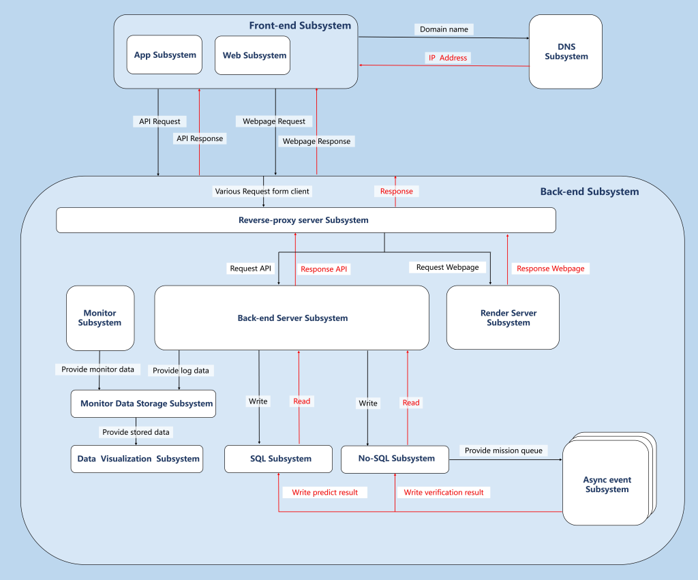
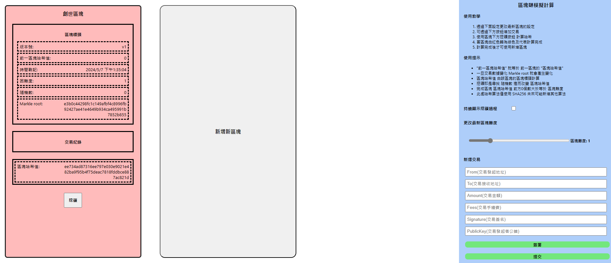
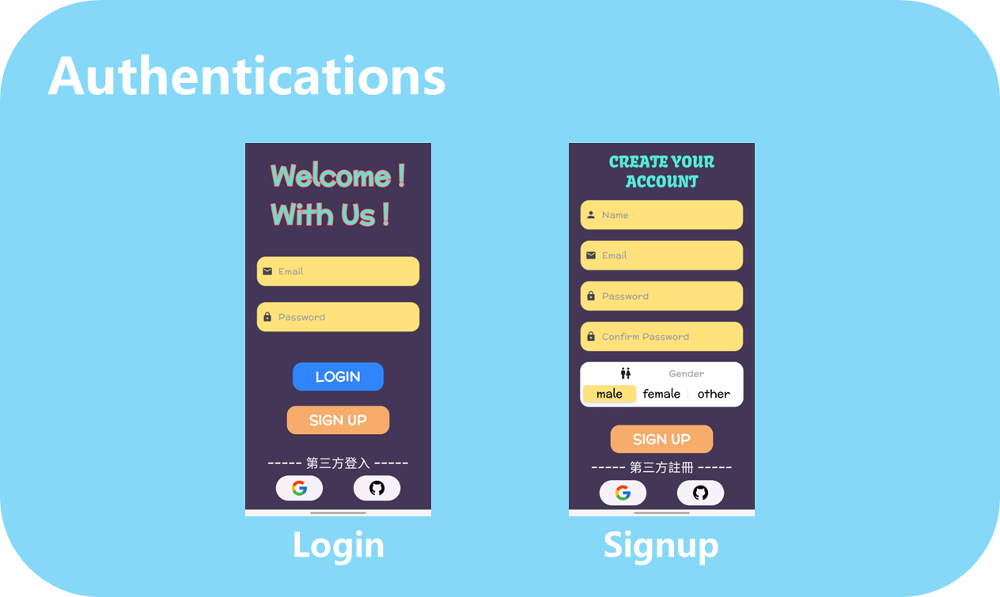
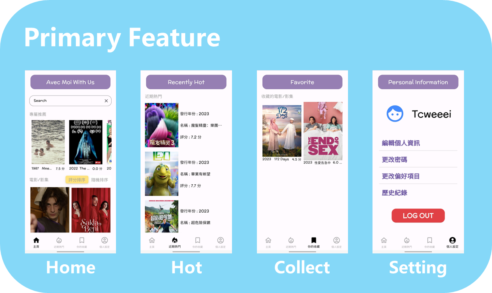

### Who am I ? 🤔
Hello 👋👋 My name is 童俊維 ( Tcweeei ).

I'm a software engineer in Taiwan. I'm interested in lots of subject including devops, front-end, back-end, AI etc.

### Contact Me 😎
Name : 童俊維 ( Chun-Wei, Tung ) ( Tcweeei ) 
Email : open891013@gmail.com  
ITHome : https://ithelp.ithome.com.tw/users/20162912/profile

[//]: # (## How can I do ? 😁)

[//]: # ()
[//]: # (| Front-end | WebSite | App | Language                | FrameWork    | )

[//]: # (|-----------|---------|-----|-------------------------|--------------|)

[//]: # (|           | ✔️      | ❌   | JavaScript / TypeScript | React.js     |)

[//]: # (|           | ✔️      | ❌   | JavaScript / TypeScript | Next.js      |)

[//]: # (|           | ❌       | ✔️  | JavaScript / TypeScript | React-Native |)

[//]: # (|           | ❌       | ✔️  | Dart                    | Flutter      |)

[//]: # ()
[//]: # (| Back-end | Language | FrameWork | Back-end | Protocol  | )

[//]: # (|----------|----------|-----------|----------|-----------|)

[//]: # (|          | Golang   | Gin       |          | Http      |)

[//]: # (|          | Python   | Flask     |          | gRPC      |)

[//]: # (|          | Python   | Fast-API  |          | WebSocket |)

[//]: # ()
[//]: # (| Database | SQL | No-SQL | Type           | Name                 |)

[//]: # (|----------|-----|--------|----------------|----------------------|)

[//]: # (|          | ✔️  | ❌      | Relation       | Microsoft SQL Server |)

[//]: # (|          | ✔️  | ❌      | Relation       | MySQL                |)

[//]: # (|          | ✔️  | ❌      | Relation       | PostgreSQL           |)

[//]: # (|          | ❌   | ✔️     | Time-Series    | Influxdb             |)

[//]: # (|          | ❌   | ✔️     | Key-Value      | Redis                |)

[//]: # (|          | ❌   | ✔️     | Document-Based | Mongodb              |)

[//]: # (|          | ❌   | ✔️     | Object-Storage | MinIO                |)

[//]: # (|          | ❌   | ✔️     | Vector-Based   | Chroma               |)

[//]: # ()
[//]: # ()
[//]: # (| Devops | Skill          | Cloud | Skill                         | AI | framework | )

[//]: # (|--------|----------------|-------|-------------------------------|----|-----------|)

[//]: # (|        | Docker         |       | Render                        |    | Pytorch   |)

[//]: # (|        | Docker-Compose |       | Google Cloud Platform &#40; GCP &#41; |    |           |)

[//]: # (|        | Kubernetes     |       |                               |    |           |)

### Side Project - Gimy Clone 🎬🎬

[In Frontend](https://github.com/weiawesome/gimy_clone_api) : User can upload the video in website and view it by http-live-streaming. 
[In Backend](https://github.com/weiawesome/gimy_clone_api) : It can convert and save the media and return the value when query happened.

Project Repository :  
https://github.com/weiawesome/gimy_clone_website  
https://github.com/weiawesome/gimy_clone_api

### Side Project - Study Savvy 👻👻

[In Frontend](https://github.com/weiawesome/study_savvy_app) : User can upload the audio file in class or graph file for article then AI will summarize and correct the content. 
[In Backend](https://github.com/weiawesome/study_savvy_api_go) : It can gain the query and using event-driven method to do some AI processing including ASR, OCR and NLP then return the result for prediction.

Project Repository :  
https://github.com/weiawesome/study_savvy_app  
https://github.com/weiawesome/study_savvy_api_go  
https://github.com/weiawesome/study_savvy_asyncwork_celery

### Side Project - BlockChain Simulation Website 🔗🔗

Project Repository :  
https://github.com/weiawesome/block_chain_simulation  

Website URL : https://block-chain-simulation.onrender.com

### Side Project - Avec Moi With Us  🎞️🎞️

[In Frontend](https://github.com/weiawesome/avec_moi_with_us_app) : User can find, get information and save the movies they like. 
[In Backend](https://github.com/weiawesome/avec_moi_with_us_api) : It can reply the request from frontend

Project Repository :  
https://github.com/weiawesome/avec_moi_with_us_app  
https://github.com/weiawesome/avec_moi_with_us_api  

<!--
**weiawesome/weiawesome** is a ✨ _special_ ✨ repository because its `README.md` (this file) appears on your GitHub profile.

Here are some ideas to get you started:

- 🔭 I’m currently working on ...
- 🌱 I’m currently learning ...
- 👯 I’m looking to collaborate on ...
- 🤔 I’m looking for help with ...
- 💬 Ask me about ...
- 📫 How to reach me: ...
- 😄 Pronouns: ...
- ⚡ Fun fact: ...
-->
