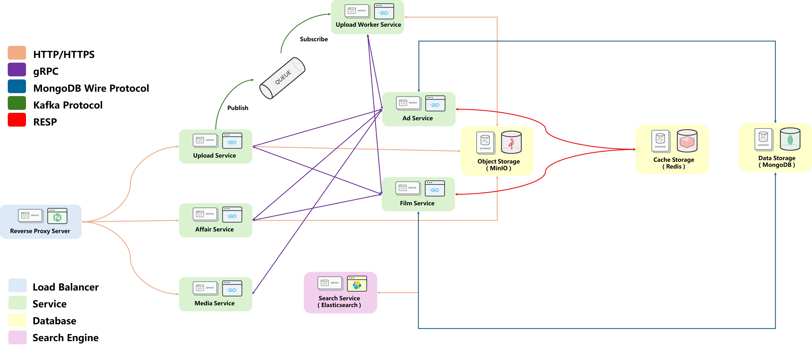
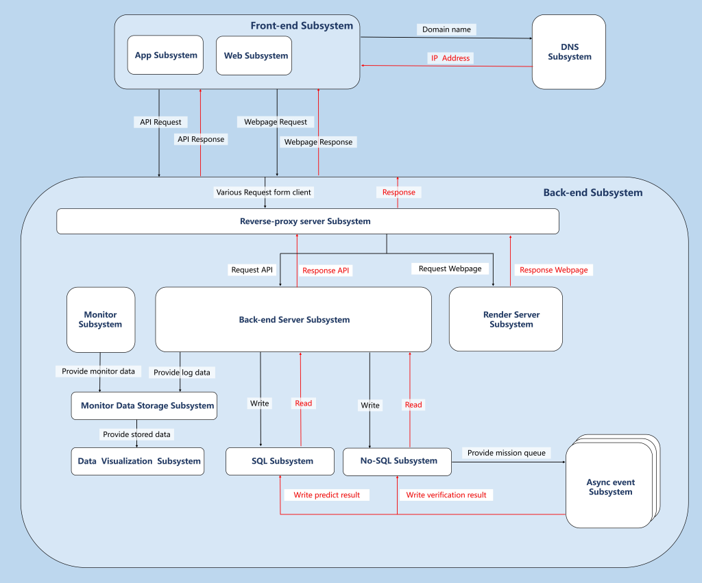
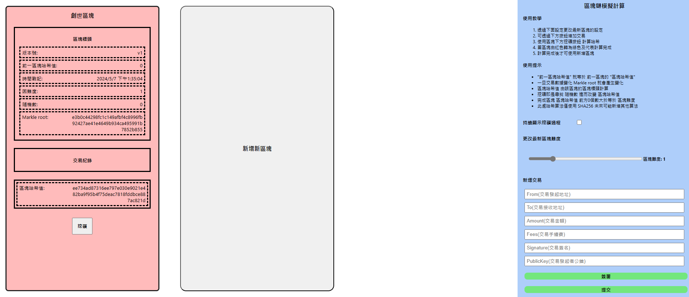

### Who am I ? 🤔
Hello 👋👋 My name is 童俊維 ( Wes ) ( Tcweeei ).

I'm a software engineer in Taiwan. I'm interested in lots of subject including devops, front-end, back-end, AI etc.

### Contact Me 😎
Email : open891013@gmail.com  
LinkedIn: https://www.linkedin.com/in/wes-tung-6481b6267/  
Credly: https://www.credly.com/users/wes  
ITHome : https://ithelp.ithome.com.tw/users/20162912/profile  

### Side Project - Gimy Clone 🎬🎬

[In Frontend](https://github.com/weiawesome/gimy_clone_api) : User can upload the video in website and view it by http-live-streaming. 
[In Backend](https://github.com/weiawesome/gimy_clone_api) : It can convert and save the media and return the value when query happened.

Project Repository :  
https://github.com/weiawesome/gimy_clone_website  
https://github.com/weiawesome/gimy_clone_api

### Side Project - Study Savvy 👻👻

[In Frontend](https://github.com/weiawesome/study_savvy_app) : User can upload the audio file in class or graph file for article then AI will summarize and correct the content. 
[In Backend](https://github.com/weiawesome/study_savvy_api_go) : It can gain the query and using event-driven method to do some AI processing including ASR, OCR and NLP then return the result for prediction.

Project Repository :  
https://github.com/weiawesome/study_savvy_app  
https://github.com/weiawesome/study_savvy_api_go  
https://github.com/weiawesome/study_savvy_asyncwork_celery

### Side Project - PixID 

Project Repository :  
https://github.com/weiawesome/PixID  

Website URL : https://weiawesome.github.io/PixID/

### Side Project - BlockChain Simulation Website 🔗🔗

Project Repository :  
https://github.com/weiawesome/block_chain_simulation  

Website URL : https://block-chain-simulation.onrender.com
